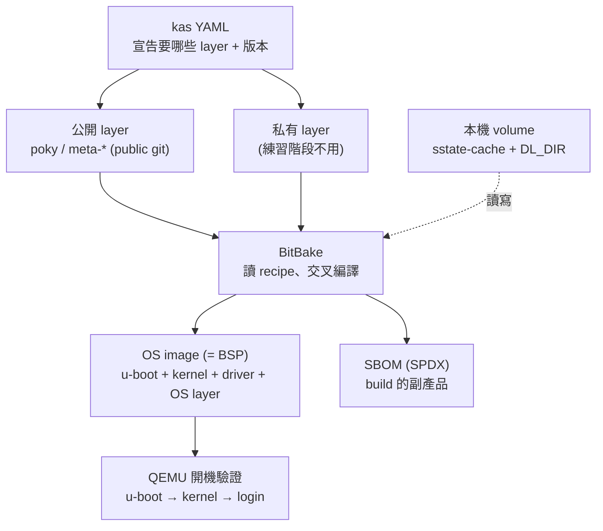

# Yocto CI + SBOM — Learning Journey

> 一個後端工程師，被改組分到 Edge AI / 嵌入式團隊後，從零開始學 **Yocto build、CI/CD 與 SBOM** 的公開學習記錄。
>
> A backend engineer's public learning log — going from "what is BSP?" to building a reproducible Yocto image pipeline that produces an SBOM.

---

## 🧭 這專案是什麼 (What & Why)

我原本是 **Node.js 後端工程師**，因為公司改組被分到負責 **ARM / Qualcomm Edge AI 產品**的團隊（AI Platform）。第一個任務是建一條 **CI/CD pipeline**，並產出 **SBOM** 供未來客戶與法規查詢。

問題是——我不是硬體背景，也不是資訊本科。BSP、Yocto、device-tree、NPU…這些詞對我全是空白。

這個 repo 記錄我「**把這些概念一個個搞懂、再串成一條能跑的 build pipeline**」的過程。練習階段刻意：

- 只用**公開 layer**（poky 等），不碰任何私有 / 硬體相依的東西
- 目標用 **QEMU 模擬**（`qemux86-64`），不需要實體開發板
- 全程在 **Docker 容器**裡跑 Yocto，本機保持乾淨

> ⚠️ 這是**個人學習專案**，不是團隊正式產出，內容可能有理解錯誤。歡迎指正。

---

## 🎯 練習目標 (Goals)

把下面這條鏈，從零跑通一次：

```
寫 kas YAML → 在容器裡 kas build（交叉編譯）→ 產出 OS image → 自動產出 SBOM → CI 自動化
```

核心是體會三件事：

1. **為什麼 build 又重又慢** → 進而理解 sstate-cache / DL_DIR 為何存在
2. **SBOM 是 build 的副產品**，不是事後手填的 Excel
3. **開發環境 ≠ 目標環境**（x86 host 交叉編譯出 ARM/其他平台的產物）

---

## 🛠️ 技術棧 (Tech Stack)

| 分類 | 用到的東西 |
| :--- | :--- |
| 建置系統 | Yocto Project, BitBake, **kas** |
| 容器 / 環境 | Docker, WSL2 (Windows host) |
| 目標 | QEMU (`qemux86-64`) — 練習階段不碰實體板 |
| 快取 | sstate-cache (編譯成品), DL_DIR (原始碼下載) |
| 合規 | SPDX (`create-spdx`) → SBOM |
| CI/CD | GitHub Actions (self-hosted runner) |

---

## 🏗️ Pipeline 概念圖 (Architecture)



---

## ✅ 實作階段與進度 (Phases & Progress)

採「先求能動，再求完整」的順序，一階段一階段來。

### Phase 1 — 跑通第一次 build
- [ ] 在 Docker 容器裡，用 kas + 公開 poky，build 出 `qemux86-64` minimal image
- [ ] 用 QEMU 把 image 開機，看到 login 提示
- **驗收**：QEMU 進得到 login

### Phase 2 — 接上快取
- [ ] 把 `sstate-cache` 與 `DL_DIR` 用 volume 掛到本機
- [ ] 改一點東西重 build，驗證明顯變快（不是從零編）
- **驗收**：第二次 build 時間大幅縮短

### Phase 3 — 產出 SBOM
- [ ] 加上 `INHERIT += "create-spdx"`，重 build
- [ ] 找到 SBOM 檔、打開來看欄位（name / version / license / checksum…）
- **驗收**：產物目錄找得到 SPDX 檔，內容對得上 image

### Phase 4 — CI 自動化
- [ ] 寫最小 GitHub Actions workflow，在 self-hosted runner 上跑 `kas build`
- [ ] build 完把 image + SBOM 當 artifact 發布
- [ ] 加上成功 / 失敗通知
- **驗收**：CI 跑完，image + SBOM 出現在 artifact

### 之後想做 (Later)
- [ ] SBOM 三層驗證（對應產物 / 內容完整 / 格式合規）做成 CI 關卡
- [ ] 嘗試把 image / SBOM 推到 artifact repository
- [ ] 換一個更接近真實的 `machine`

---

## 📚 概念筆記 (Concept Notes)

學習過程中把每個名詞用「**後端工程師聽得懂的方式**」整理下來。可能不夠嚴謹，但夠我自己理解。

### 架構基礎 (Foundations)
| 名詞 | 一句話理解 | 後端類比 |
| :--- | :--- | :--- |
| **x86 / ARM** | 晶片的兩種「語言」(指令集)；開發機是 x86，出貨設備是 ARM | `amd64` vs `arm64` 的 Docker image |
| **Cross-compile** | 在 x86 上，產出 ARM 能跑的東西 | `docker build --platform linux/arm64` |
| **SoC** | 把 CPU/GPU/NPU 等整合進「同一顆晶片」 | 多功能一體機 vs 一堆獨立家電 |
| **CPU / GPU / NPU** | 通用大腦 / 大量併行(訓練) / 專做 AI 推論又省電(Edge) | — |

### 開機與系統 (Boot & System)
| 名詞 | 一句話理解 |
| :--- | :--- |
| **BSP** | 讓某塊「特定板子」能開機跑系統的一整包底層軟體（是產物，不是工具） |
| **u-boot** | bootloader；通電後最早跑，載入 kernel 後交棒退場（屬韌體 firmware） |
| **Linux Kernel** | 應用程式與硬體之間唯一的窗口；app 透過 system call 請它代勞 |
| **device-tree** | 描述「這塊板子有哪些硬體、接哪根腳位」的設定檔（ARM 硬體不會自我介紹） |
| **driver** | 讓 kernel 認得特殊硬體 (NPU/FPGA) 的程式 |
| **OS Layer** | kernel 之上的函式庫 / 工具 / 服務；kernel + OS Layer 才是完整作業系統 |

### 建置系統 (Build System)
| 名詞 | 一句話理解 | 後端類比 |
| :--- | :--- | :--- |
| **Yocto** | 「從原始碼組出一整套客製 Linux」的工廠 | `npm install` + build + `docker build` 的超大型版 |
| **BitBake** | Yocto 的建置引擎，讀 recipe 去編譯 | 執行 build 的 engine |
| **recipe (`.bb`)** | 描述「單一元件」怎麼抓 / 編 / 裝 | `package.json` + `Dockerfile` 合體 |
| **layer** | 一大包 recipe 的集合 | 一個套件庫 / 一本食譜書 |
| **kas** | 用一份 YAML 把整個 build（要哪些 layer、版本、容器）固定成可重現 | `docker-compose.yml` |
| **sstate-cache** | 快取「編譯完的成品」，沒變就跳過重編 | Docker layer cache |
| **DL_DIR** | 快取「下載來的原始碼」，抓過就不再抓 | npm / pip 套件下載快取 |

> 🔑 食譜比喻：**kas YAML = 要搬哪幾本食譜書(layer)** → **recipe = 一份食譜** → **BitBake 照食譜做** → **BSP / OS image = 做好的成品**。recipe 不是 BSP 的零件，而是「生產 BSP 的說明書」。

### 交付與合規 (Delivery & Compliance)
| 名詞 | 一句話理解 | 後端類比 |
| :--- | :--- | :--- |
| **SBOM** | 軟體成分表：列出產物用了哪些元件 / 版本 / license / 來源 | 整套 OS 的、標準化的、給外人看的 `package-lock.json` |
| **SPDX** | SBOM 的一種標準格式；Yocto 內建可自動產出 | — |
| **CRA** | 歐盟網路韌性法案，要求 SBOM、漏洞通報、lifecycle 安全維護 | 逼團隊把交付鏈做齊的外部壓力 |
| **OTA (執行層 vs 控制層)** | 怎麼更新 (A/B partition, UEFI Capsule, OSTree) vs 什麼能更新、能否降版 | 部署機制 vs 部署治理 |

---

## 💡 給自己的提醒 (Notes to Self)

- 第一次從零 build **真的會跑一兩小時、吃幾十 GB** — 卡住不代表壞掉，多半是正常在編。
- 所有 Yocto 檔案要放在 **Linux 檔案系統 (WSL2 `~/`)**，不要放在 `/mnt/c/...` 上 build。
- 我要維護的是「一台 Linux 伺服器 (runner)」，**不是那塊 ARM 板子** — 別把硬體底層的恐懼套錯對象。
- 我負責「**怎麼把這包做出來**」(pipeline)；BSP / driver 的內容是硬體同事的事。
- SBOM「產出來」只是一半，「**驗證它對得上產物**」才是合規要的。

---

## 📌 Status

🚧 學習進行中 (Work in progress) — 目前進度見上方 checklist。

*This is a personal learning project. Content may contain mistakes. Feedback welcome.*